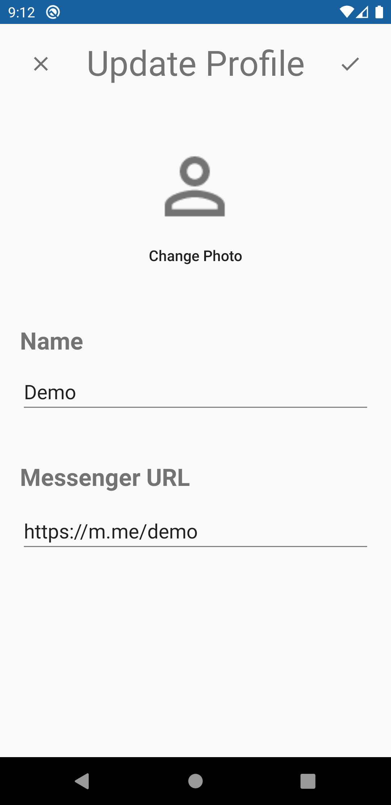

This repository contains the code for the Reco Android application - a university assignment. 

Reco is an android application that matches users based on their music preferences.
It allows users to search for music and build up a library.
Based on the contents of the library, Reco matches a user with others and creates recommendations.

## Installation
Download and install **Reco v1.0-beta** directly from https://github.com/iamaldi/Reco/releases/download/v1.0-beta/reco-v1.0-beta.apk

## Infrastructure
In this project we wanted to showcase the use of MVVM architectural components.
The application is backed by a REST API service written in [python](https://fastapi.tiangolo.com/).
More details on the API can be found at https://github.com/iamaldi/reco-api

## Application Screenshots

